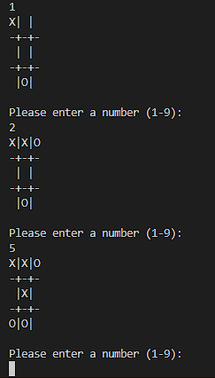
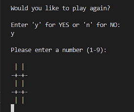
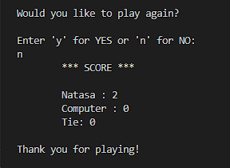

# TESTING

## Manual testing

### Features

Feature Tested | Expected Result | Actual Result | Pass/Fail
---------------|-----------------|--------------|--------------
Type a name and press enter | Receive a message "Welcome {name}! Let's play!", show the rules and print board | As expected | Pass
Enter a number from 1 to 9 | Input should be seen on the board in a matching square | As expected | Pass
Player type option number | It should progress to next stage entering the computer input on board | As expected | Pass
Random computer move on board | It should be entered after every user action on random location| As expected | Pass
Player wins the game | Receive a message "Congratulations! You are the winner!" and give option to play again| As expected | Pass
Computer wins the game | Receive a message "Game over! Your opponent beat you!" and give option to play again| As expected | Pass 
Tie game | Receive a message "Game over! It is a tie!" and give option to play again| As expected | Pass 
Player chooses to play again | The new board displays on the screen and prompts to enter a number from 1 to 9 | As expected | Pass
Player chooses not to play again | The score should show on the screen and a message "Thank you for playing!" | As expected | Pass

### Invalid input  

Input | Expected Result | Actual Result | Pass/Fail
-------------|-----------------|---------------|----------
Type something other than letters when asked for name | Receive a message "Please use the letters to input your name!" | As expected | Pass
Type something other than a number when asked for entering a number 1-9 on the board | Receive a message "Input must be a number between 1 and 9" | As expected | Pass
Type a number less than 1 and greater than 9 | Receive a message "Your input number is not between 1 and 9!" | As expected | Pass
Try to input the same number twice | Receive a message "This place is already taken. Choose another spot!" |  As expected | Pass
Try to input something other than 'y','Y','n','N' during option to play again | Receive a message "Invalid answer. Press 'y' to start and 'n' to quit"| As expected | Pass

## Bugs

Bug | Status | Fix  
----|--------|-----
My game did not want to check who wins | Resolved | Instead of using only set(w).issubset(set(COMPUTER_SELECTION), I added any() function to that so it could iterate through my lists and find a winning combination that matches the player's selections.
When the player chose to restart the game, the filled board from the previous round would be displayed | Resolved | I only emptied the board variable but user selection and computer selection variables had to be emptied as well.

## Remaining Bugs

  * No bugs remaining.

## Validator Testing

* [CI Python Linter](https://pep8ci.herokuapp.com/)

Due to the PEP8 being down, I used Code Institute's Python Linter which confirmed that there are no errors. 

[PEP8CI](docs/images/pep8.png)

## Testing User Stories

* As a visiting user, I would like to be able to play the game against an opponent.
    * The user is playing against the computer. After the user enters the move, the computer's choice should be displayed on the board right after that. 
    * User and computer should take turns in entering their moves. 
   
    

* As a visiting user, I would like to be able to restart the game. 
    * When one of the players wins the game or if it's a tie, it should be displayed the question to play again.
    * User should enter 'y' to play again the game or 'no' to exit the game.

    

* As a visiting user, I would like to be able to see the final score of the game.
    * When the question to play again shows on the screen and if user enters no, the score should be displayed on the screen where the user can see how many times he won or lost.  
    
    
